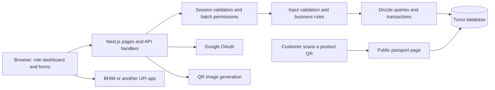

# WoolTrace — Mini-project presentation and viva guide

## 1. The idea in plain words

WoolTrace connects the life of a wool batch: the farm, shearing, laboratory measurements, sale, transport, storage, processing and the finished product. A QR code opens a public page showing the recorded journey and the source farmer. Farmers receive buyer offers directly and choose the offer they accept.

**One-line pitch:** “WoolTrace gives wool a readable digital history from shearing to product, while helping farmers sell directly to buyers.”

The first geographic focus is Karnataka. The farmer records their own source and shearing details. A laboratory, transporter or processor contributes only after the batch owner grants that account access. WoolTrace provides traceability records; independent certification is outside the current scope.

## 2. The problem we are solving

- Source, quality and custody details often live in separate paper records or conversations.
- A finished product can lose its connection to the farmer who produced the wool.
- Farmers need a place to compare buyer prices and collection terms directly.
- Different participants need different tools: a buyer should not get a shearing form, and a laboratory should not receive seller payment controls.
- Customers need an easy way to read the recorded history without creating an account.

The application brings these records into one source-linked system. Its records improve visibility; the application cannot physically prove that a tagged bag has never been swapped.

## 3. Tech stack and why we selected it

| Technology | Where it is used | Why it is useful |
|---|---|---|
| React 19 | Forms, dashboards, role selection and interactive demo | Reusable components and immediate feedback while entering data |
| Next.js 16 | Pages, server rendering and API route handlers | Frontend and backend live in one deployable application |
| TypeScript | Application code and API data types | Catches incorrect shapes and unsupported operations before deployment |
| CSS and Tailwind CSS 4 | Responsive layouts and interface styling | Shared styling across pages; custom mint, teal and yellow theme |
| Lucide React | Interface icons | A consistent icon system with accessible labels |
| Zod | Request body, date and input validation | The server checks incoming data instead of trusting browser fields |
| Turso / libSQL | Persistent application database | Hosted SQLite-compatible database suitable for a serverless application |
| Drizzle ORM | Typed database queries and migrations | Keeps schema, query code and controlled schema upgrades together |
| Google OAuth 2.0 | Account sign-in | Users choose an existing Google account; no phone OTP or stored password |
| Node crypto / Web Crypto | OAuth state, signed sessions and event hashes | Random challenges, HMAC signing and SHA-256 consistency checks |
| Sharp | Server-side shearing-photo decoding and compression | Rejects malformed image data and normalizes stored JPEGs |
| Browser canvas | Photo resizing before upload | Reduces upload size before the photo reaches the server |
| qrcode | Public passport and UPI QR generation | Produces a QR from a URL or UPI payment URI |
| BHIM / UPI | Direct seller payment | The buyer pays the seller’s UPI ID; WoolTrace does not hold money |
| Open-Meteo, optional | Attributed farm-weather information | Provides weather context when the appropriate service configuration is enabled |
| GitHub | Source repository and automated checks | Tracks changes and runs the project checks |
| Vercel | Hosting | Builds the Next.js application from the main branch and hosts pages and APIs |

Exact installed versions are recorded in package.json and package-lock.json. The project runs with Node.js 22.13 or newer; the configured Vercel environment uses Node 24.

## 4. Architecture



The browser shows forms and sends JSON requests to the application’s API. The server checks the signed session, selected role and batch access. It validates the data, performs the database change, and returns a result. The interface announces success or explains which field needs attention.

Public passport pages fetch the batch and its events from the database on the server. Sensitive details such as Google email, UPI settings and full payment references are not added to the public history.

The QR code stores a link, not the entire database record. This allows the same public page to show later events without printing a new source-batch QR every time a stage is added.

## 5. What each portal does

| Role | Main tasks | How it gets batch access |
|---|---|---|
| Farmer | Register source, complete shearing, list wool, compare offers and confirm payment | Own source records |
| Buyer | Browse listings, make offers, pay the seller, record receipt and invite partners | Purchase after seller-confirmed payment |
| Laboratory | Record sample receipt, grade, micron and staple length | Current owner invites the laboratory’s Google email |
| Transporter | Record pickup and delivery | Owner invitation for the transport role |
| Warehouse | Record intake and release | Owner invitation for the warehouse role |
| Processor | Record processing and create source-linked output lots | Owner invitation for the processor role |
| Brand / retail | Record finished products and create product lots | Owner invitation for the brand role |

The selected role changes navigation, dashboard guidance and available workspace pages. A direct link to another role’s portal redirects to the account’s selected portal. Batch permissions are checked again by the API; hiding a button alone is not permission control.

Roles are self-selected. Selecting “laboratory” does not make an account accredited or give it access to every batch. Invitations are an access grant; the current version does not automatically send an email.

## 6. Main workflows and the logic behind them

### 6.1 Google sign-in

1. The user chooses Continue with Google.
2. The application generates random OAuth state and a PKCE verifier/challenge.
3. Google asks the user to select an account and returns an authorization code.
4. The callback checks state and exchanges the code using the server’s credentials and PKCE verifier.
5. The application reads the verified account identity and creates an expiring, HMAC-signed session cookie.
6. The server matches the verified Google email to batch invitations. One assigned role opens that portal automatically. Multiple roles open My assignments so the member can choose a job. A new member with no invitations chooses a role during onboarding.

The session cookie is HTTP-only, so normal browser JavaScript cannot read it. Secure cookies are used over HTTPS. Google credentials and the signing secret remain server environment variables. Google verifies account control; it does not verify a farm or the truth of a wool record.

The browser demonstration at /demo uses sample state and does not need Google sign-in. The isolated test preview has Google sign-in disabled so it cannot send users to Google with placeholder credentials.

### 6.2 Source registration and shearing

1. A farmer enters the farm/group, village, district, state, breed, shearer, start date, expected weight and reserve price.
2. The server checks the role and calendar date. A future shearing date is rejected.
3. A transaction creates the farm, source batch and first event together.
4. The farmer later supplies the completion date, actual weight and photo.
5. The browser resizes and compresses the photo. The server decodes it, checks its format and dimensions, and re-encodes a bounded JPEG.
6. Completion updates the batch and appends the shearing event. Listing is a separate explicit farmer action.

The image is stored as compressed JPEG data in the current database implementation. This keeps the mini project self-contained. A larger deployment should evaluate object storage and database backup size.

Dates entered as calendar dates are validated consistently in India time. The actual stage date and the server’s recording timestamp can be stored separately, so a participant can describe when the work happened without changing when the entry was added.

### 6.3 Marketplace and buyer offers

The marketplace shows completed batches explicitly listed by their source farmer. A buyer submits a price per kilogram, pickup time and payment terms. The offered price must meet the reserve price. A buyer cannot bid on their own source wool or submit two active offers on the same batch.

The farmer accepts an active offer in a transaction. Other active offers become not selected. Acceptance reserves the sale; the farmer remains the owner until payment is confirmed. The seller can cancel an unpaid sale, after which the batch is unlisted.

**Terminology for presentation:** The interface uses “reverse bidding”, but the implemented mechanism is competing buyer offers for farmer-listed wool. In a conventional procurement reverse auction, suppliers compete to lower their selling price. Be precise about this distinction if asked.

### 6.4 BHIM / UPI payment and ownership transfer

The seller saves their UPI ID and recipient name in their farmer profile. For an accepted, unpaid offer, the application computes:

```text
payment amount = accepted price per kg × source batch weight
```

It creates a UPI URI containing the recipient, amount, currency and offer reference, then converts that URI into a QR. The buyer scans it using BHIM or another compatible UPI app.

A QR scan does not confirm a bank credit. The seller checks their bank account and enters the transaction reference. One transaction saves a private payment receipt, marks the offer paid, changes the current owner to the buyer and appends a public seller-confirmed event. The public note contains only a redacted reference ending.

The full reference, amount, confirming account and confirmation timestamp are available to the seller and winning buyer. The application does not perform automatic bank reconciliation or act as escrow.

### 6.5 Partner invitations and stage records

The current owner grants an email access for a particular stage role. The invited participant signs in with the same Google email; the server routes them to their assigned workspace. My assignments lists all work granted to that email. Opening a job checks the invitation again, changes the active workspace, and preselects its batch. Normal API calls never override a deliberately chosen workspace. Removing an invitation immediately prevents further updates, even if an old assignment card is still open.

Assignments grant stage access, not ownership or seller controls. A saved service plan is separate from an email assignment, and granting access does not send an email notification. The owner should tell the partner to sign in.

The server checks both role and invitation when recording a stage. Transport requires pickup before delivery, and an open pickup cannot be duplicated. Storage requires intake before release. The supported scouring, carding, spinning and weaving stages follow their recorded prerequisites. Repeating a completed non-cyclic stage is rejected.

Transport and storage may have later cycles. The batch’s summary status represents the furthest recorded progress, so a later collection does not erase a previously recorded downstream stage. The complete event list remains the detailed history.

### 6.6 Event consistency and the hash chain

Each event includes the batch, event type, title, location, account, role, notes, timestamp, previous event hash and optional image hash. New events can include the performed date. A canonical JSON representation is hashed with SHA-256.

```text
event hash = SHA-256(canonical event fields + previous event hash)
```

The passport recalculates hashes and checks the links. If a stored event or photo changes without matching its stored hash, the page reports that the chain could not be checked successfully.

This is a consistency check in a normal database. It is not a blockchain or an externally immutable ledger. A sufficiently privileged database operator could rewrite records and recompute the chain. It also cannot establish whether a farmer’s original statement was true.

Legacy events omit newly introduced optional fields when recalculating their original hashes, preserving compatibility.

### 6.7 Child lots and product traceability

An invited processor or brand creates output lots linked to a source batch. A lot may also link to a parent lot. Examples include clean wool → yarn → fabric → finished product.

The sum of sibling lot weights cannot exceed the source or parent’s available weight. Creating a child lot is transactional, preventing two simultaneous allocations from each consuming the same remaining capacity.

The product-lot QR opens its own public page and links back through its parent/source records. This preserves the original farmer when one source batch produces several outputs. The current model supports one source batch per lot; multi-source blending and separate stage histories for every individual child lot are future work.

### 6.8 Service plans, laboratory directory and weather

- The service planner saves the provider and planned date. The user contacts the provider to confirm arrangements.
- Karnataka laboratory entries are outreach leads, with map/source links. Listing a laboratory does not mean it has joined the platform or certified a batch.
- Optional weather uses a configured provider and displays its source and observation time. It is not a wool-price feed and does not automatically locate the user’s farm.
- Marketplace prices come from buyer offers. There is no fabricated live wool-price service.

### 6.9 Browser demonstration

There are seven role walkthroughs at /demo. They use sample records saved in sessionStorage, separated by role and browser tab. Refreshing the same tab restores its demo progress. Another role starts its own walkthrough.

Demo actions do not write to the production database, grant access, transfer ownership or make payments. Its QR preview opens a fixed illustrative passport; local demo edits are not published on that page.

### 6.10 Usability improvements

Forms use labelled controls, logical sections, examples, unit suffixes, date bounds, photo previews and field-specific validation messages. On smaller screens, controls become a single column and use larger text to make typing easier. Buttons show a saving state and prevent repeated submissions during the same request. Feedback is announced to assistive technology.

The shared visual theme uses mint, cream, deep teal and yellow. The original farmer photograph remains on the landing page. Decorative vector sheep and hills are hidden from screen readers because they do not add functional information.

## 7. Database structure

| Table | Important data | Relationship / purpose |
|---|---|---|
| users | Google subject ID, email, name, selected role, organisation and private UPI settings | Account identity and workspace preference |
| farms | Owner, name and locality | Original source location |
| wool_batches | Farmer, farm, breed, dates, weight, quality, lifecycle status, sale status and current owner | Central source batch |
| batch_events | Actor, role, stage, notes, recording date, performed date, photo and hashes | Append-only application history |
| bids | Buyer, batch, price, pickup days, terms and status | Direct competing offers |
| payment_receipts | Offer, full reference, amount, confirming account and timestamp | Private payment reconciliation record |
| batch_participants | Batch, invited email, role and inviting owner | Access to a particular batch stage |
| product_lots | Source batch, optional parent, type, name, weight and creator | Traceable output hierarchy |
| bookings | User, optional batch, provider, service, date and status | User-managed service plans |
| rate_windows | Account, minute window and request count | Database-backed API rate limiting |

The original farmer ID and current owner ID are separate. A sale changes the owner without replacing the recorded source farmer.

## 8. API structure

| Endpoint | Main responsibility |
|---|---|
| /api/auth/google and /api/auth/google/callback | Begin and finish Google OAuth |
| /api/auth/logout | Clear the session |
| /api/profile | Read/update role and organisation |
| /api/batches | List, register, list for sale or unlist source batches |
| /api/batches/events | Record an authorized stage |
| /api/batches/quality | Submit invited laboratory measurements |
| /api/bids | Read offers, create/withdraw them, accept/cancel sales and confirm payment |
| /api/participants | Grant, inspect or remove partner access |
| /api/lots | Read/create source-linked output lots |
| /api/bookings | Save/read/cancel service plans |
| /api/payments/upi | Seller UPI settings and unpaid-offer payment QR |
| /api/live/overview | Optional attributed weather |
| /api/health | Operational status without exposing credentials |
| /batch/:id and /lot/:id | Public QR passport pages |

Large batch, offer and service lists use pagination. Dashboard totals are computed across the full authorized record set, rather than only the first displayed page.

## 9. Security and deployment logic

- Server credentials are environment variables and are excluded from Git.
- Signed, expiring sessions are checked before private API operations.
- Role and batch-owner/invitation checks enforce permissions.
- JSON request bodies have size limits; Zod validates their contents.
- Cross-origin API mutations are rejected by the application’s origin check.
- Database rate windows limit repeated requests from an account.
- Image decoding has a pixel limit and stored-output size limit.
- Transactions group operations that must succeed together, such as accepting a sale and transferring paid ownership.
- Payment references stay in private records; only a short ending appears publicly.
- Browser security headers restrict embedding and certain browser capabilities.
- GitHub checks run lint, build, workflow tests and a production dependency audit.
- Vercel builds the main branch. Production runs additive database migrations before promoting the new deployment.

The compatibility migration restores completion markers for legacy completed records and labels old acceptance-time transfers as historical transfers. It does not falsely label those historical transfers as bank-confirmed payments.

Required deployment variables: APP_BASE_URL, AUTH_SECRET, GOOGLE_CLIENT_ID, GOOGLE_CLIENT_SECRET, TURSO_DATABASE_URL and TURSO_AUTH_TOKEN. Optional weather configuration is explained in API_SETUP.md. Keep real values out of this presentation and repository.

## 10. What is implemented and what remains

**Implemented:** seven role workspaces, Google sign-in, self-recorded farm/shearing data, photo compression and validation, explicit marketplace listing, competing buyer offers, direct UPI QR, seller-confirmed ownership transfer, partner access, laboratory measurements, stage dates/history, hash consistency checks, source-linked output lots, service planning, laboratory outreach directory, optional weather, public QR pages, browser demos, responsive forms and automated checks.

**Limitations / future work:** independent farm or certification verification, automatic bank confirmation, escrow/disputes, automatic provider booking and email invitations, multi-source wool blending, stage history per individual child lot, licensed wool-price feeds, and a formal record-correction workflow. Operational launch work includes backups/restore exercises, alerting and the owner’s support/operating policies.

The application fetches current records when pages load, actions complete or the user refreshes. It does not currently use WebSockets for continuously streamed updates.

## 11. A two-minute speaking script

“Our mini project is WoolTrace, a wool traceability and direct trading platform focused initially on Karnataka. The problem is that the origin and processing history of wool are scattered, and farmers need a clearer way to compare buyer offers.

“A farmer signs in with Google, selects the farmer role and records the source batch. After shearing, they add the date, final weight and a photo. The photo is compressed on the device and validated again on the server. They can then list the batch for buyer offers.

“Buyers have their own dashboard. They inspect the public wool passport and submit price and pickup terms. The farmer accepts an offer, the buyer pays the seller directly through a BHIM-compatible UPI QR, and ownership changes only after the seller confirms receipt.

“The current owner invites laboratories, transporters, warehouses, processors and brands to contribute their own stages. Each event keeps its account, date and connection to the earlier record. A hash chain helps detect inconsistencies. Processing outputs get child-lot QR pages that still point to the original farmer.

“We built the interface with React, Next.js and TypeScript, used Turso with Drizzle for the database, and deployed it through GitHub and Vercel. We also created separate browser demos for all seven roles. Our project provides readable provenance records; independent certification and automatic bank reconciliation are future integrations.”

## 12. Suggested five-minute demo

1. Show the landing page and explain the source-to-product idea.
2. Open /demo and show the seven role choices.
3. Use the farmer walkthrough to explain source registration and completion.
4. Use the buyer walkthrough to explain offers and seller acceptance. State that sample actions do not move money.
5. Open the illustrative passport and explain origin, actor, dates and the QR URL.
6. Show the processor/brand walkthrough and explain source-linked child lots.
7. Finish with the architecture diagram and one honest limitation.

For a real-account demonstration, prepare a completed batch, invited test participants and matching Google accounts before presenting. Do not display secrets, private payment information or live bank details on the projector.

## 13. Viva questions and answers

### 1. What is the main innovation?
One source-linked record connects wool provenance with direct buyer offers and role-specific stage contributions. A customer reaches the readable history using a QR.

### 2. Why React and Next.js?
React gives us reusable forms and interactive screens. Next.js adds server-rendered public pages and backend API handlers in the same application, which simplifies deployment.

### 3. Why Turso instead of storing everything in the browser?
Real users need shared, durable records across devices. Turso provides a hosted SQL database. Only the clearly labelled demo uses browser storage.

### 4. What does Drizzle do?
It maps database tables to typed code, builds SQL queries and manages schema migrations. Transactions still enforce the multi-step business operations.

### 5. What information is actually inside the QR?
A public passport URL containing the batch or lot identifier. The full history is read from the database when the page opens.

### 6. Does Google verify that someone is a farmer?
No. It verifies control of the Google account. Farm details are self-reported, and independent verification is outside the current scope.

### 7. Can someone select the laboratory role and edit every batch?
No. The API requires a matching owner invitation for that email, batch and role.

### 8. What happens if a buyer opens a farmer portal URL?
The page redirects to the buyer’s selected portal. The API also checks roles independently, so changing a URL or crafting a request does not grant farmer permissions.

### 9. Is the event chain blockchain?
No. It is a SHA-256 hash chain stored in the application database. It detects inconsistent changes relative to stored hashes, but it is not a distributed immutable ledger.

### 10. Can the QR guarantee the physical wool is genuine?
No. It shows recorded provenance. Strong physical guarantees require additional controls such as trusted inspection, tamper-resistant tags or third-party verification.

### 11. What if the farmer enters false details?
The account attribution identifies who submitted the record, but the current application does not independently verify its truth. That is a clearly stated limitation.

### 12. How do you reduce middlemen?
Farmers list their own wool, receive buyer offers and select the terms directly. Transport and laboratory partners remain useful service participants rather than compulsory trading intermediaries.

### 13. Is this a conventional reverse auction?
The implemented workflow is competing buyer offers for a seller-listed batch. We use the product term “reverse bidding”, but distinguish it from procurement auctions where suppliers lower their prices.

### 14. How is the payable amount calculated?
Accepted price per kilogram multiplied by batch weight, rounded to two decimal places.

### 15. Why use BHIM instead of Razorpay?
The project requirement is direct payment to the seller’s UPI ID. A standard UPI URI works with BHIM and compatible apps without integrating a payment gateway.

### 16. How do you know payment succeeded?
The seller checks their bank account and confirms the reference. The app records this as seller confirmation; it does not claim to have verified the bank transaction automatically.

### 17. Can the buyer confirm payment and take ownership themselves?
No. The source seller/current owner must perform the confirmation. The database transaction updates the receipt, offer, ownership and event together.

### 18. What if two offers are accepted at the same time?
The acceptance uses a write transaction and rechecks the batch sale state. Only an active offer on a listed batch can be accepted; the remaining active offers are marked not selected.

### 19. Are full payment references public?
No. They are kept in a private receipt and returned only within the authorized seller/buyer offer scope. The public history shows a short redacted ending.

### 20. How are photos handled?
The device resizes and compresses the photo. The server decodes it with Sharp, enforces pixel/size limits, then stores a normalized JPEG. Merely sending JPEG header bytes is rejected.

### 21. Why validate on the server when the form already validates?
Anyone can bypass a browser form and send a direct request. Server validation protects the actual stored data and business rules.

### 22. Can participants enter a future shearing date?
No. The server accepts a valid calendar date up to today in India time. Completion must not precede the start date.

### 23. Can delivery be recorded before pickup?
No. Transport has an open-pickup prerequisite and rejects duplicate or out-of-order handoffs.

### 24. What is the difference between the work date and recording time?
The work date describes when the participant says the stage happened. The recording timestamp is generated by the server when the event is added and preserves audit order.

### 25. What happens when one wool batch makes several products?
Each output lot links to the source or a parent lot. Sibling allocations must remain within the parent’s weight, accounting for processing loss.

### 26. Can multiple farms be blended into one lot?
Not in the current model. A multi-source composition graph is a future feature and would require weight contributions from each source.

### 27. Is every child lot tracked with its own independent stage history?
Currently, lots have identity, weight and parent/source links, while stage events are attached to the source batch. Independent lot-stage history is future work.

### 28. Are the listed Karnataka laboratories partners?
They are outreach leads. A real laboratory participates only after it signs in and receives a batch invitation. Its inclusion in the directory is not an accreditation claim.

### 29. Does the service planner automatically book a transporter?
No. It records the user’s plan; they contact the provider separately to confirm it.

### 30. Is market information live?
Listings and offers come from database records when fetched. Optional weather comes from an attributed external provider. There is no invented live wool-price feed or WebSocket market stream.

### 31. How does the demo avoid changing real data?
Its sample state is stored in sessionStorage per role and tab. Demo actions do not call mutation APIs or create an authenticated production identity.

### 32. How do you test it?
An automated script creates a temporary local database and test identities, then checks ownership, roles, offers, payments, photos, dates, stage rules, pagination and migrations. Lint and a production build check the code. A real Google account and bank flow still need separate acceptance testing.

### 33. What happens to old records after a database upgrade?
Additive migrations preserve them. Legacy completed batches receive compatible completion markers. Earlier acceptance-time transfers are explicitly treated as historical transfers rather than invented bank confirmations.

### 34. How does the application deploy?
Changes are pushed to the GitHub main branch. Vercel builds the application, runs production migrations and promotes the new deployment if those steps succeed.

### 35. What would you improve next?
Independent verification, physical tag/custody controls, corrections and disputes, automatic notifications, provider integrations, bank reconciliation, multi-source blending, lot-specific stage records and operational monitoring.

## 14. Presentation claims to keep accurate

Say “farmer-recorded”, “invited participant”, “seller-confirmed payment”, “public traceability page” and “hash consistency check”. Explain what those mean with one concrete example.

Avoid claiming government certification, verified physical authenticity, blockchain, automatic bank confirmation, enrolled laboratory partners, automatic logistics booking or continuously streamed real-time prices. The strongest presentation is a working demo plus a precise explanation of its scope.

## 15. Account switching, weather and AI insights

The workspace dropdown switches the active role on the same Google account, without asking the user to return to their profile. A dedicated role endpoint preserves organisation, UPI settings and records. Partner invitations and ownership checks remain enforced: choosing Transporter does not unlock someone else's wool. Demo switching changes only the sample portal.

The insights page offers Karnataka district selection. Open-Meteo provides model-based current weather and three-day forecasts when the operator enables a suitable plan. Public WoolTrace listings are grouped by district, breed and grade to show recent seller asking-price ranges; these are not independent market rates or completed sales. A wool-specific external price provider remains a pending integration.

An optional server-side Gemini assistant explains the displayed data and workflow for the active role. A user must opt in to sending the question, area, role and aggregate source data. The assistant receives no automatic account identity, private offers or payment data, has no write tools, and must not invent missing prices or forecasts. Requests are authenticated, bounded, timed out and rate-limited. Source data and human decisions remain authoritative. Setup is documented in INSIGHTS_SETUP.md.

**Q: Does AI discover the current wool price?** No. It explains the supplied data; only a connected, dated wool-price feed could supply external current rates.

**Q: Can a role switch bypass access restrictions?** No. The role changes the tools and navigation. Database ownership and matching-email invitations still determine batch access.

**Q: Are the API tests live-provider tests?** No. Isolated fixtures check parsing, consent, routing, failures and rate limiting without external credentials. Production provider connectivity requires separate testing after configuration.
